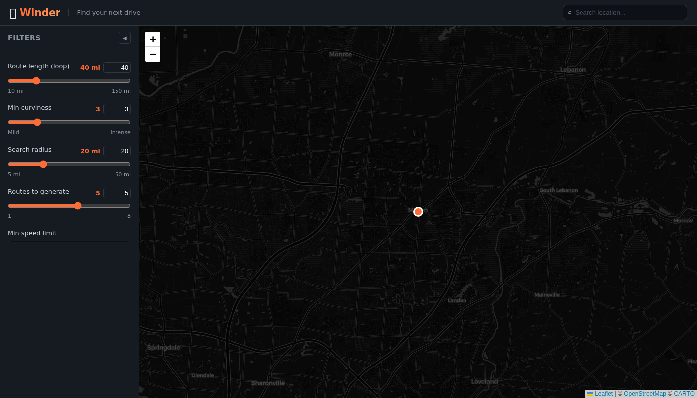
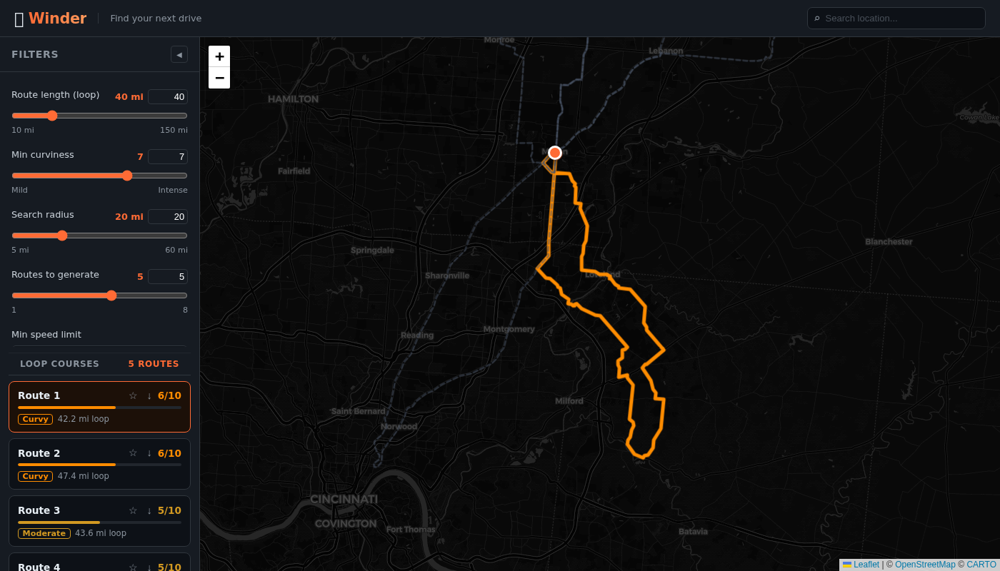
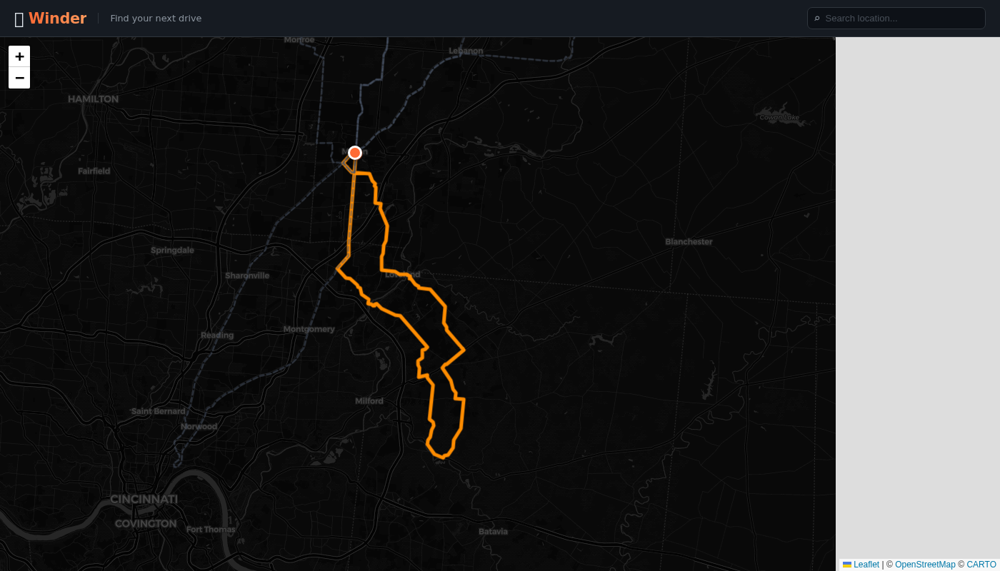

# 〰️ Winder

**Find curvy driving loop routes near you.**

Winder uses OpenStreetMap road data to generate closed loop driving routes scored by curviness — so you can stop driving the same boring highways and start finding the roads that are actually fun.



---

## Features

- **Loop route generation** — Routes start and end at the same point with no backtracking or overlapping segments
- **Curviness scoring** — Each route is scored 1–10 based on how twisty the roads are
- **Smart filtering** — Filter by target distance, minimum curviness, search radius, speed limit, and road types
- **Location search** — Search any city or address in the header bar; the map and search pin jump there instantly
- **Draggable search pin** — Drop the orange pin anywhere on the map to generate routes from that exact spot
- **Multiple routes** — Generates up to 8 distinct loops per search, each taking a different direction from your location



- **Favorites** — Save loops you like with the ★ button; favorites persist across sessions and can be renamed or deleted
- **GPX export** — Export any route as a `.gpx` file compatible with OsmAnd, Gaia GPS, Komoot, and other navigation apps



---

## How It Works

1. **Enter a location** in the search bar (or allow location access) and adjust the filters
2. **Click Find Loop Courses** — Winder fetches road data from OpenStreetMap's Overpass API
3. Routes are generated using a **two edge-disjoint path algorithm**: it finds a midpoint in a compass direction, then discovers two completely separate routes to that midpoint and combines them into a loop
4. Results are **scored and ranked** by a combination of curviness and closeness to your target distance
5. Click any route in the list or on the map to preview it; save favorites or export to GPX

---

## Filters

| Filter | Description |
|---|---|
| Route length | Target loop distance in miles |
| Min curviness | Minimum average curviness score (1=mild, 10=intense) |
| Search radius | How far from your location to pull road data |
| Routes to generate | How many distinct loops to find (1–8) |
| Min speed limit | Exclude roads below this speed limit |
| Road types | Which OSM road classifications to include |

---

## Tech Stack

- **React + Vite** — frontend
- **Leaflet / react-leaflet** — interactive map
- **OpenStreetMap + Overpass API** — road data (free, no API key needed)
- **Nominatim** — geocoding for the location search bar
- **localStorage** — favorites persistence

---

## Running Locally

```bash
npm install
npm run dev
```

Open [http://localhost:5173](http://localhost:5173).

---

## Deploy

The app is 100% client-side. Deploy to any static host:

**Vercel (recommended):**
```bash
npx vercel
```

**Netlify:** drag-and-drop the `dist/` folder after running `npm run build`.
